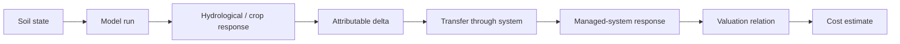
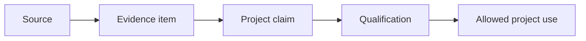

# Colleague reader guide

Status: **Status-A-light onboarding / working documentation**  
Audience: WENR/WUR project colleagues, reviewers and domain experts  
Purpose: explain what the project is doing before the reader enters the detailed technical documentation

## 1. In three minutes

This project develops a defensible way to estimate the consequences and costs of soil compaction for agriculture and society.

The central idea is deliberately simple:

```text
soil compaction
    ↓
soil physical / hydraulic state
    ↓
parcel response
    ↓
water-system or production consequence
    ↓
qualified effect
    ↓
valuation / cost
```

The difficult part is not writing one equation. The difficult part is preventing steps in this chain from being collapsed without evidence.

For example:

- a compacted soil class is not automatically a yield-loss percentage;
- generated parcel runoff is not automatically water delivered to a ditch;
- ditch-delivered water is not automatically pump volume;
- installed pump capacity is not automatically event-specific available capacity;
- a historical euro-per-cubic-metre figure is not automatically a current societal cost.

The project therefore separates **state**, **response**, **attribution**, **transfer** and **valuation** and records the evidence and qualification required at each step.

## 2. What question are we actually trying to answer?

The broad project question is whether the consequences of soil compaction can be quantified in a way that is scientifically defensible and useful for policy and practice.

For colleagues it is useful to split that into two families of questions.

### On-site

What changes for the agricultural parcel or farm because the soil state is compacted?

Examples include crop response, rooting, drought sensitivity, waterlogging, additional irrigation need and other direct production consequences.

### Off-site

What changes outside the parcel because the hydrological or material response is transferred to a larger system?

The most developed off-site route at present is water:

```text
parcel response
  → field-edge response
  → ditch/network response
  → managed water-system response
  → pumping/capacity/energy
  → direct expenditure or other valuation category
```

Nutrients and other pathways may later fit the same architecture, but they are not silently assumed to be solved by the water module.

## 3. Why current versus reference is central

A measured or modelled current state does not by itself tell us how much damage is attributable to compaction.

We therefore use a counterfactual comparison:

```text
CURRENT state
same event, crop, geometry and boundary context
REFERENCE state
```

For a response quantity `Y`:

`delta_Y = Y_current - Y_reference`

The scientific purpose of the matched pair is to isolate the soil-state difference that is being attributed.

This means that a valid reference state is not just a convenient low-density soil value. It must be compatible with the same soil/profile context and must have a defensible interpretation.

## 4. The project has two linked architectures

### 4.1 Physical/economic architecture



### 4.2 Evidence architecture



These two architectures must stay linked.

A number can only become a model parameter when we know both **what the number means physically** and **what use the evidence supports**.

## 5. Source, evidence, claim and qualification are different things

This distinction is essential for reading the repository.

A **source** is a report, dataset, API, administrative publication or other identifiable source/version.

An **evidence item** is one atomic fact or relation extracted from that source.

A **claim** is a project interpretation based on one or more evidence items.

A **qualification** records whether the evidence or claim supports a particular intended use and under which dependencies or guardrails.

Example from the Tollebeek pilot:

- source: owner-backed information about gemaal De IJsvogel;
- evidence: installed capacity is 540 m3/min;
- project claim: 540 m3/min is the admitted installed-capacity benchmark;
- qualification: usable as installed-capacity evidence, but not as event-specific available capacity or as effective capacity of the whole OT.02 system.

The distinction prevents a sourced number from silently becoming a stronger statement than the source supports.

## 6. Why Tollebeek is being used

Tollebeek is a **pilot and qualification case**, not the national endpoint.

It is useful because several parts of the full chain can be made concrete:

- a managed polder water system;
- a known peil-area history;
- explicit pumping assets;
- a coupled IJsvogel/Kievit system;
- a plausible light-zavel soil context;
- historical Noordoostpolder SWAP precedent;
- identifiable gaps in current geometry, drainage, soil state and operational telemetry.

That combination lets us test whether the architecture works before making broader national claims.

The pilot should therefore answer two questions separately:

1. can we construct a qualified **source response** from current versus reference soil states?
2. can that response be transferred through a real managed system without hidden assumptions?

## 7. What is already structurally ready?

At the current Status-A-light stage the following architecture is explicit and represented in code/schema:

- matched current/reference attribution;
- generated runoff-volume identity;
- event-conditioned transfer semantics;
- explicit source-zone to pump dispatch;
- no hidden default for assist fraction or pump availability;
- pump-energy identity using total dynamic head and efficiency;
- separation of direct budget expenditure, private cost and societal welfare concepts;
- source/evidence/claim/qualification registers;
- a canonical field and dataset schema;
- a schema-driven workbook generator.

This does **not** mean that the Tollebeek impact has been quantified.

## 8. What remains data-gated?

The most important unresolved scientific inputs remain visible on purpose.

For Tollebeek these include:

- reviewed current OT.02 geometry;
- current spatial drainage configuration;
- depth-resolved current compaction state;
- matched reference state;
- event-specific source-to-ditch/network transfer;
- current post-2020 Kievit operating curve;
- pump availability, control logic, head, efficiency and energy telemetry;
- paired current/reference SWAP results.

A missing value in these places is not treated as zero and is not filled with a convenient default.

## 9. How GitHub, Excel and the future application relate

The repository is the canonical scientific/technical structure.

```text
GitHub canonical state
  ├─ documentation
  ├─ schema / data model
  ├─ evidence registers
  ├─ code
  └─ tests
        ↓
      adapters
        ↓
  ├─ Excel workbooks
  ├─ dashboards
  └─ future application
```

Excel is therefore a **review and user interface**, not the project database and not the ultimate definition of scientific meaning.

A workbook column should map to a canonical field definition. The future application should use the same definitions rather than invent a second interpretation of the data.

## 10. How to read a generated workbook

The target workbook structure is:

- `00_METADATA`: what artifact is this, from which schema/commit, and for what purpose?
- `01_GUIDE`: how should the file be read?
- `DATA_DICTIONARY`: full field definitions, units and guardrails;
- dataset sheets: one clearly defined dataset/table with an explicit row grain;
- views: human-readable summaries that are not source tables.

Column headers remain compact. Selecting a header can show a short description derived from the canonical field metadata. The full definition remains in `DATA_DICTIONARY`.

When a sheet says that one row represents `event × source zone × pump asset`, that grain is part of the scientific meaning of the table.

## 11. What should colleagues challenge?

The documentation is intended to make review easier, not to make choices look final.

Useful review questions include:

- Is the causal relation physically correct?
- Is current versus reference defined fairly?
- Does the dataset grain match the scientific process?
- Are we transferring evidence beyond the population, soil, crop, place or time for which it was established?
- Are two quantities with similar units actually the same concept?
- Is a historical benchmark being mistaken for a current model parameter?
- Does the implementation preserve the formal model and null semantics?
- Is a value qualified for the use we are making of it?

A colleague should be able to disagree with a scientific choice without first reverse-engineering an Excel formula.

## 12. Recommended reading paths

### If you want the scientific story

1. this reader guide;
2. `01_overview.md`;
3. `02_theoretical_framework.md`;
4. `03_conceptual_model.md`;
5. `04_formal_model.md`.

### If you work with data or code

1. this reader guide;
2. `05_data_model.md`;
3. `06_implementation.md`;
4. `08_workbook_architecture.md`;
5. `11_tollebeek_vertical_slice_v0_2.md`.

### If you review evidence or scientific defensibility

1. this reader guide;
2. `07_evidence_and_qualification.md`;
3. `13_tollebeek_evidence_baseline_v0_1.md`;
4. `evidence/` registers;
5. the traceability matrix in `15_traceability_matrix_v0_1.md`.

## 13. Current documentation status

This repository intentionally calls itself **Status-A-light** rather than Status A.

The aim is to use Status-A-like discipline early:

- explicit scientific meaning;
- traceability across theory, model, data and code;
- evidence qualification;
- reproducible implementation;
- known gaps recorded rather than hidden.

The current documentation is a working scientific baseline. It should become more complete as the project obtains current spatial soil/drainage information, runs the paired models and qualifies the transfer and valuation steps.
