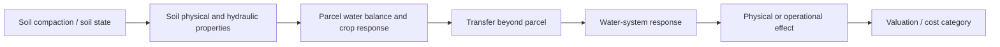

# 1. Project overview

Status: **Status-A-light working documentation**

This document is the recommended starting point for colleagues who want to understand what the project is trying to calculate, how the pieces fit together, and which parts are already implemented or still evidence-gated.

## 1.1 Working purpose

The project develops a transparent and defensible system for estimating the consequences and costs of soil compaction for agriculture and society.

The repository does **not** treat this sentence as the exact formal wording of the project proposal objective. It is the current modelling purpose used to organise theory, data, code and evidence. Exact proposal or contractual wording should be copied from the authoritative project document when that wording is added to the repository.

The system is intended to support questions such as:

- how does a compacted soil state differ physically and hydraulically from a relevant reference state?
- how does that difference affect crop production and the parcel water balance?
- which part of a parcel response can propagate beyond the parcel?
- where and when does that response become relevant to the managed water system?
- which physical consequences can be translated into private, public-budget or societal-welfare effects?
- where are the dominant uncertainties and missing links?

The purpose is therefore wider than producing one damage number. The project must also make the causal path, evidence status and uncertainty behind that number inspectable.

## 1.2 Core causal chain

The working causal chain is:



In compact form:

**soil state → response → attribution → transfer → system effect → valuation**

The project deliberately does not jump directly from a compaction class to euros.

## 1.3 Five analytical layers

For most pathways the calculation is separated into at least five layers.

### A. Soil state / exposure

What physical state exists, where, at what depth and under which land use?

Examples include bulk density, texture, organic matter, compacted-layer geometry, profile identity and severity classifications. A reporting class may be useful for national summaries, but a hydrological calculation should retain the underlying state variables where available.

### B. Physical or biological response

What does that state do under specified weather, crop and boundary conditions?

Examples include transpiration, root-zone stress, surface runoff, drainage, groundwater response and yield. Response is conditional on forcing and system context; it is not an intrinsic constant attached to a soil class.

### C. Attribution

How much of the response is attributable to the soil-state difference of interest?

The preferred design is a matched current/reference comparison in which forcing, crop, geometry and boundary assumptions are held constant and only the admitted soil-state dimensions differ.

### D. Transfer

How does a generated parcel effect reach a receptor or managed system?

For water this may include field-edge occurrence, ditch delivery, network routing, storage and pump allocation. Generated runoff is therefore not automatically delivered runoff, and delivered runoff is not automatically pump volume.

### E. Valuation

Which qualified physical effect can legitimately be expressed as money, and under which economic concept?

Private farm cost, public-budget expenditure and societal-welfare effect are separate valuation categories. A transfer payment or historical expenditure is not automatically societal damage.

## 1.4 On-site and off-site

The project uses `on-site` and `off-site` to distinguish where consequences occur, not to create two unrelated models.

**On-site** includes consequences experienced at farm or parcel level, such as crop-production effects, extra field operations or irrigation expenditure.

**Off-site** includes consequences that propagate to other actors or systems, such as additional water-system loading, pumping, water-supply pressure or other downstream effects.

The same soil-state and parcel-response layer can therefore feed both routes. This is important for consistency and for avoiding double counting.

## 1.5 Spatial and temporal scale

The project must support national statements, but not by pretending that every parcel can be represented by one national coefficient.

The working strategy is:

```text
national exposure / soil-land-use basis
        ↓
representative soilscapes or profile-context combinations
        ↓
qualified source-response calculations
        ↓
receptor / water-system transfer rules or pilots
        ↓
aggregation with explicit applicability and uncertainty
```

Time scale also matters. Annual volumes can sometimes be summed, while event occurrence, peak discharge, storage, routing, pump dispatch and damage are generally nonlinear. Event timing and antecedent state must therefore remain available where the pathway depends on them.

## 1.6 Current focus and the role of Tollebeek

The most developed off-site pathway is water. Nutrients, pesticides and other pathways may later use the same architecture but require their own theory, evidence and qualification.

Tollebeek OT.02 is the current managed-water-system vertical slice. It is used to force the framework to become concrete across theory, data, code and evidence. Tollebeek is **not** the definition of the general framework and is **not** the national endpoint.

The Tollebeek line currently demonstrates:

- explicit source/evidence/claim/qualification records;
- a managed-water-system rather than free-drainage context;
- parcel-generated volume semantics;
- event transfer as a separate layer;
- explicit two-zone/two-pump dispatch semantics;
- pump-energy equations with no hidden head or efficiency defaults;
- a generated workbook interface whose populated evidence comes from repository state.

The hydrological attribution itself remains data-gated until current spatial soil, drainage and boundary information is sufficiently qualified.

## 1.7 What is canonical

The GitHub repository is the canonical scientific and technical project structure.

Canonical state includes, as appropriate:

- documentation under `docs/`;
- schemas and controlled vocabularies under `schema/`;
- source, evidence, claim and qualification registers under `evidence/`;
- shared calculations under `src/`;
- qualification/software checks under `tests/`;
- explicit artifact specifications and generators.

Excel workbooks, dashboards and the future application are **interfaces and artifacts**. They may expose canonical content, but they do not define scientific meaning independently.

## 1.8 Maturity model

A useful way to read the current project state is by layer rather than by one overall percentage complete.

| Layer | Current state | Meaning |
|---|---|---|
| Theory | DEVELOPING | Core causal and counterfactual structure is explicit; literature synthesis is still being curated. |
| Conceptual model | STRUCTURED | Main entities and relationships are defined. |
| Formal model | PARTIAL | Core water-path equations and null/default rules are formalised; not every pathway is implemented. |
| Data model | MIGRATION BASELINE | v0.2 separates canonical entities/datasets from legacy workbook layout. |
| Evidence | FIRST CANONICAL SLICE | Tollebeek source → evidence → claim → qualification is populated. |
| Code | FIRST VERTICAL SLICE | Generated volume, pump dispatch and energy semantics have software tests. |
| Hydrological attribution | BLOCKED DATA | Current/reference soil state, drainage, geometry and event boundary still need qualified data. |
| Water-system operation | PARTIAL / BLOCKED DATA | Topology is qualified; event-specific assist, availability, head and efficiency need operational data. |
| Valuation | ARCHITECTURE READY | Cost categories and sequencing are defined; current € estimates require qualified physical effects and current economic inputs. |
| User-facing application | NOT YET PRIMARY | Data/model contracts are being stabilised before application expansion. |

## 1.9 Non-negotiable guardrails

The following rules are deliberately repeated across documentation, schema, tests and workbooks because violating them would change scientific meaning:

- unknown is not zero;
- current/reference attribution must be explicit;
- generated parcel runoff is not automatically field-edge, ditch or pump volume;
- a static universal runoff-delivery factor is not a project default;
- installed pump capacity is not automatically event-specific available capacity;
- target water level is not total dynamic pump head;
- historical benchmark values are not current parameters unless separately qualified;
- reporting classes are not automatically causal response functions;
- crop-specific evidence is not silently transferred to all land use;
- budget cost, private cost and welfare effect remain separate;
- a passing software test does not by itself qualify scientific realism.

## 1.10 How colleagues should read the documentation

Recommended reader path:

1. **this overview** for scope, language and maturity;
2. [`02_theoretical_framework.md`](02_theoretical_framework.md) for the causal and counterfactual logic;
3. [`03_conceptual_model.md`](03_conceptual_model.md) for the objects and relationships;
4. [`04_formal_model.md`](04_formal_model.md) for equations and formal rules;
5. [`05_data_model.md`](05_data_model.md) for datasets, keys, fields and null semantics;
6. [`06_implementation.md`](06_implementation.md) for mapping to code, workbooks and the future app;
7. [`07_evidence_and_qualification.md`](07_evidence_and_qualification.md) for the rules that decide what evidence may support which project use.

The later numbered documents record workbook migration, concrete vertical slices and implementation milestones. They are useful for provenance and engineering detail, but colleagues do not need to read them first.
