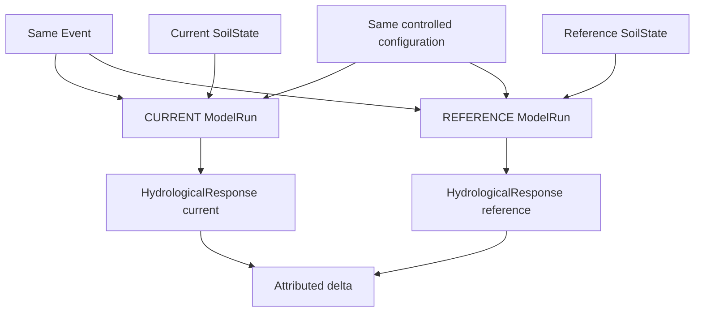
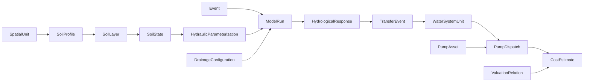
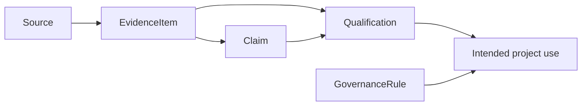

# 3. Conceptual model

Status: **Status-A-light conceptual baseline**

The conceptual model translates the theoretical framework into explicit objects, states and relationships without yet committing to a database technology, Excel layout or programming language.

Its main purpose is to answer: **what kinds of things exist in this project, what does one record represent, and how do those things relate?**

## 3.1 Design principles

The conceptual model follows six rules.

1. **Scientific objects exist independently of software representation.** A soil layer is not an Excel row and a pump dispatch is not a dashboard widget.
2. **State and event are explicit.** A value that changes by scenario, time or operating condition should not be attached permanently to the wrong object.
3. **Source facts and project interpretations are different objects.** Evidence is not a claim and a claim is not automatically an admitted parameter.
4. **Transfer stages are explicit.** Generated parcel water, field-edge water, network water and pump volume are not synonyms.
5. **Views do not create new scientific entities.** Aggregated tables and dashboards should be derived from registered objects.
6. **A scenario is first a combination of existing context dimensions.** Introduce a separate scenario entity only when scenarios need their own stable identity, provenance, review lifecycle or reuse across workflows.

## 3.2 Main object families

### Spatial context

#### `SpatialUnit`

A spatial analysis or reporting unit with an explicit geometry or reference.

Examples may include a parcel, soilscape, peilgebied, routing zone or reporting stratum. A `SpatialUnit` must state its role; a 1,497 ha administrative peilgebied and a smaller affected compaction area are not interchangeable merely because both have an area.

#### `LandUseCrop`

The crop or land-use classification applicable to a spatial unit and time/context.

This object allows broad reporting categories and crop-specific response evidence to coexist without silently treating them as the same level of detail.

### Soil system

#### `SoilProfile`

A vertical profile associated with a spatial unit, sampled location or derived profile representation.

#### `SoilLayer`

A depth interval within a profile. It carries properties whose meaning is primarily layer-specific, such as texture or organic matter.

#### `SoilState`

A physical state assigned to a profile/layer for `CURRENT`, `REFERENCE` or an explicit `SCENARIO` role.

Bulk density is conceptually a state variable when the project is comparing alternative physical conditions. Texture, by contrast, is normally part of the profile/layer context and should not change between a matched current/reference pair unless the scientific question explicitly requires it.

#### `HydraulicParameterization`

A versioned transformation from one `SoilState` plus its retained profile/layer context to the soil hydraulic functions consumed by the source-response model. It records whether the functions are direct-measurement based, pedotransfer-derived or scenario/envelope based; the exact method/version; the hydraulic representation; and uncertainty/member identity.

This object is separate from `SoilState` because a measured bulk density or penetration resistance is not itself a complete water-retention/conductivity function. It is separate from `ModelConfiguration` because CURRENT and REFERENCE may legitimately have different state-specific hydraulic functions while sharing the same constitutive-model and numerical configuration.

#### `DrainageConfiguration`

The subsurface and surface drainage representation used for a spatial unit or model run. It may include depth, spacing, resistance, controlled drainage or multiple drainage systems.

Drainage is separate from soil state because changing drainage configuration changes the system, not merely the compaction state.

## 3.3 Event and model objects

#### `Event`

A meteorological/hydrological event or simulation window. It identifies the time context that makes occurrence, antecedent state and timing meaningful.

#### `ModelConfiguration`

A versioned set of model structure, boundaries and numerical choices shared by one or more runs.

Examples include the choice of managed lower boundary, drainage representation and numerical configuration. Configuration identity is needed to make paired current/reference runs reproducible.

#### `ModelRun`

One controlled model execution for a defined spatial unit, state, event and model configuration.

A run is not itself a scientific conclusion. It is an execution whose outputs may later be compared and qualified.

#### `HydrologicalResponse`

Hydrological output associated with a run. The data model may store responses in long or compatible wide form, but conceptually the response belongs to the run.

Examples include surface runoff, drainage, evapotranspiration, groundwater state and water-balance diagnostics.

### Scenario context

For the current project maturity, scenario meaning is normally reconstructed from explicit existing objects and fields, for example:

```text
SoilState
+ LandUseCrop
+ Event / forcing
+ DrainageConfiguration
+ ModelConfiguration / water-system context
+ ValuationRelation
+ time or frequency semantics where relevant
```

This prevents an opaque label such as `DRY_HIGH_DAMAGE` from hiding which physical or economic assumptions actually changed.

The model does not yet require a universal `Scenario` entity. Such an entity becomes justified only if scenarios acquire independent lifecycle needs, such as stable cross-workflow IDs, separate provenance, explicit approval, reuse or versioning.

## 3.4 Counterfactual pair

The conceptual unit for attribution is a matched pair of runs:



The pair itself does not need to become a separate database entity immediately, but the IDs must make the matching relation reconstructable.

## 3.5 Transfer objects

#### `TransferEvent`

One event-scale record describing the response at a declared transfer stage for a source unit.

The currently recognised stages in the Tollebeek vertical slice are:

```text
GENERATED_PARCEL
FIELD_EDGE
DITCH
NETWORK
PUMP_INTAKE
```

The stages prevent one volume from being reused under different meanings.

A `TransferEvent` may be unknown at a downstream stage while an upstream value is known. The unknown downstream value remains null; it is not zero.

#### `WaterSystemUnit`

A receiving, routing or management unit such as a ditch network, peilgebied or other managed-system unit.

#### `RoutingLink`

A conceptual connection between source/receiving units. The current canonical entity set does not yet require a separate persisted `RoutingLink` table, but the concept is important for future network implementations.

## 3.6 Pump and operational objects

#### `PumpAsset`

A physical pumping asset/configuration with versioned technical metadata.

Capacity, motor configuration and pump curve belong to an asset/configuration version, not to every event.

#### `PumpDispatch`

The allocation of routed event volume from a source zone to a pump asset under an operating state.

One row conceptually represents:

```text
event × source zone × pump asset
```

Event-specific variables such as availability fraction, pumped volume, assist fraction, total dynamic head and operating efficiency belong here or to closely related operational records.

#### `CapacityPressure`

Currently represented as a derived dispatch quantity rather than a separate persisted entity. It compares required pump time with a defined response window. It is an operational diagnostic, not a damage threshold by itself.

## 3.7 Valuation objects

#### `ValuationRelation`

A versioned relation translating a qualified physical effect to a defined economic category.

Examples could include electricity expenditure per kWh or an output-price relation, but only when the physical effect and economic scope are explicitly defined.

#### `CostEstimate`

A result obtained by applying a valuation relation to a qualified physical effect for a stated scope.

The conceptual model must preserve the valuation category, such as:

- private cost;
- public-budget cost;
- societal-welfare effect.

A generic `cost` object without this distinction is insufficient.

## 3.8 Evidence and governance objects

The evidence model runs alongside the physical model.

#### `Source`

A bibliographic, administrative, dataset, service or system source/version.

#### `EvidenceItem`

One atomic fact, measurement, relation or historical model setting extracted from a source.

#### `Claim`

An explicit project interpretation that may combine or constrain one or more evidence items.

Example pattern:

```text
source A: historical capacity
source B: nominal hardware description
source C: renovation information
        ↓
project claim: current operational capacity remains unknown
```

#### `Qualification`

An assessment of whether an evidence item or claim supports one defined project use, including dependencies and limitations.

#### `GovernanceRule`

A formal project rule or gate such as `unknown is not zero` or `installed capacity must not be labelled available capacity`.

#### `DataRequestItem`

A missing dataset or field that is explicitly needed to remove a scientific or operational block.

## 3.9 Two parallel graphs

The project can be understood as two linked graphs.

### Physical/economic graph



### Evidence/decision graph



The graphs meet when a physical/model field or relation needs evidence for a particular use.

## 3.10 Tollebeek as an implementation example

Tollebeek is useful because it exercises many object types without redefining the general model.

A simplified mapping is:

```text
OT.02                    → WaterSystemUnit / SpatialUnit context
IJsvogel, Kievit         → PumpAsset
historic source zones    → SpatialUnit / source_zone_id
wet event                → Event
paired SWAP run          → ModelRun
extra generated runoff   → HydrologicalResponse
field/network transfer   → TransferEvent
zone-to-pump allocation  → PumpDispatch
incremental electricity  → CostEstimate input
```

The Tollebeek example also demonstrates why evidence metadata matter: `540 m3/min installed capacity` is a different concept from `availability_fraction`, `pumped_volume_m3` or `current effective system capacity`.

## 3.11 Grain and identity

Each canonical dataset must define what one row represents. This is a conceptual requirement, not only a database convention.

Typical grains are:

- one row per source/version;
- one row per evidence item;
- one row per soil profile;
- one row per profile × layer × state;
- one row per event;
- one row per controlled model execution;
- one row per source unit × event × transfer stage;
- one row per event × source zone × pump asset;
- one row per qualified physical effect × valuation relation × scope.

Stable IDs allow those grains to be represented consistently in CSV, Excel, a relational database or an application API.

## 3.12 Conceptual boundary

The conceptual model is intentionally more stable than the current workbook and less detailed than final software classes.

A new entity should be introduced only when it has distinct scientific identity or grain. A new Excel sheet, chart, filter or user-interface screen is not by itself a reason to create a new domain entity.
