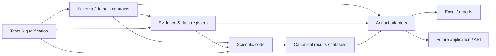

# 6. Implementation

Status: **Status-A-light implementation baseline**

This document explains how the theoretical, conceptual, formal and data models map to code, data registers, generated workbooks and the future application.

The implementation objective is not to preserve the prototype Excel architecture. It is to preserve scientific meaning while allowing multiple interfaces to consume the same canonical project state.

## 6.1 Architectural direction

The intended implementation separates the following concerns:



The key point is that Excel and the application sit **downstream** of the same scientific/data contracts.

## 6.2 Repository roles

The repository currently separates:

### `docs/`

Human-readable scientific and architectural documentation.

### `schema/`

Machine-readable entity, relationship, field, dataset, vocabulary and artifact contracts.

### `evidence/`

Canonical source, evidence, claim and qualification registers.

### `src/`

Shared scientific and data-processing code that should not depend on a particular user interface.

Current implemented vertical-slice modules include:

- `src/transfer/volume.py`;
- `src/water_system/dispatch.py`;
- `src/water_system/energy.py`.

### `tools/`

Build, migration and validation tools. The workbook generator is an adapter, not the scientific model itself.

### `tests/`

Software, schema, evidence-integrity and eventually scientific qualification tests.

### `artifacts/`

Documentation/metadata about generated deliverables. Binary artifacts do not automatically belong in version control when they can be reproducibly generated.

## 6.3 Scientific code rule

A formal scientific relation should have one preferred implementation where practical.

For example, generated water volume should not be implemented independently in:

- an Excel formula;
- a dashboard script;
- the backend application;
- a separate analysis notebook.

Instead, shared code should implement the relation and interfaces should call or reproduce it only through a clearly tested adapter when direct reuse is technically impossible.

This reduces semantic drift.

## 6.4 Current vertical-slice code

### Generated source volume

`src/transfer/volume.py` implements the conversion from affected area and attributable runoff depth to generated volume.

Important implementation semantics:

- negative physical area is rejected;
- missing area or runoff difference returns unknown/null;
- the returned volume is explicitly source-generated volume, not downstream delivery.

### Two-pump dispatch

`src/water_system/dispatch.py` implements a generic two-zone/two-pump dispatch suitable for the current Tollebeek semantics.

Important semantics:

- assist fraction has no default;
- availability has no hidden default;
- missing allocation information propagates as a waiting/unknown state;
- the implementation does not encode a scientific claim that every managed system has the Tollebeek routing topology.

### Pump energy

`src/water_system/energy.py` implements the hydraulic energy identity.

Important semantics:

- total dynamic head is explicit;
- efficiency is explicit;
- missing operating-point information remains unknown;
- the function does not infer current Tollebeek pump efficiency from historical data.

## 6.5 Evidence is implementation input, not comments

Important scientific values should not exist only as comments in code or prose next to a spreadsheet cell.

The intended flow is:

```text
source
  ↓
evidence register
  ↓
claim / qualification
  ↓
versioned configuration or model input
  ↓
model execution
```

This makes it possible to ask not only `what value did the model use?`, but also `why was that value allowed for this use?`.

## 6.6 Configuration versus code

Site-specific or scenario-specific values should normally be data/configuration rather than hard-coded program constants.

Examples include:

- pump capacity;
- source-zone identity;
- assist routing rule;
- drainage configuration;
- reference-state selection;
- economic price year.

True physical constants and stable equations may live in code where appropriate.

The distinction allows the same scientific implementation to be reused for multiple pilots without copying code.

## 6.7 Excel implementation

Excel is a generated, documented interface and review artifact.

The current workbook contract requires front matter:

- `00_METADATA`;
- `01_GUIDE`;
- `DATA_DICTIONARY`.

Every dataset sheet should then declare:

- dataset ID;
- entity;
- role;
- grain;
- primary key;
- canonical status;
- source or derivation.

Compact column headers are supplemented by descriptions generated from field metadata. The current adapter exposes these through Excel data-validation input messages, with the complete definition retained in `DATA_DICTIONARY`.

### Populated versus blank sheets

The generator deliberately supports both:

- populated canonical datasets, such as the current evidence registers;
- blank templates for scientifically blocked datasets.

A blank `HYDRO_RESPONSE` table therefore communicates `the result is not yet scientifically supported`, not `the spreadsheet is unfinished`.

## 6.8 Workbook generation

The current adapter under `tools/workbook_generator/` follows:

```text
schema
+ canonical evidence/data CSV
+ artifact specification
+ Git commit
        ↓
 generated .xlsx
```

The generated artifact records its schema version and Git commit so a colleague can trace it back to repository state.

The spreadsheet library is an implementation detail. Scientific semantics must remain portable if the project later replaces the adapter.

## 6.9 Future application architecture

The application should be built after the domain/data contracts are sufficiently stable, not by converting existing workbook sheets directly into screens.

A likely application architecture has four functional layers:

### Data and evidence layer

Queries canonical reference data, evidence and qualified configuration.

### Calculation/orchestration layer

Runs or reads model calculations using shared domain code.

### Service/API layer

Exposes stable domain datasets and derived views to the client.

### Presentation layer

Provides goal-oriented views for users, for example:

- national exposure/impact overview;
- pathway drill-down;
- pilot evidence;
- uncertainty/data-gap view;
- scenario or comparison view where scientifically admitted.

User-interface navigation should follow user questions rather than mirror repository folders or workbook tabs.

## 6.10 Persistence strategy

The project does not yet require one database technology.

Different data types may use different physical stores:

- schema and small registers in version-controlled YAML/CSV;
- relational records in a future project database;
- large raster/GIS datasets in geospatial files/services;
- high-frequency telemetry or model outputs in suitable columnar/time-series storage;
- generated reports/workbooks as artifacts.

Stable IDs and metadata connect these stores conceptually.

## 6.11 Reproducibility

A reproducible result should eventually identify at least:

```text
repository commit
schema version
input dataset/version IDs
model configuration ID
software/model version
spatial unit
state role
forcing/event
run ID
qualification/evidence snapshot where relevant
```

A generated workbook already carries part of this information. Production runs should extend the same principle to model execution manifests.

## 6.12 Test hierarchy

The implementation distinguishes different types of passing evidence.

### Software/unit tests

Check that code performs its declared calculation and error/null semantics correctly.

### Schema/contract tests

Check field names, dataset mappings, controlled vocabularies and artifact specifications.

### Data-quality tests

Check ranges, IDs, units, geometry, missingness and internal consistency of actual datasets.

### Numerical/model qualification

Check model behaviour against independent numerical references, balances or known cases.

### Scientific plausibility/validation

Check whether model response is compatible with relevant observations or established evidence.

### Transfer/operational validation

Check event routing, water-system behaviour and pump operation against actual system data.

A green software CI does not make a physical Tollebeek result scientifically qualified.

## 6.13 Continuous integration

The repository now has lightweight GitHub Actions CI that:

- compiles the current Python tools;
- validates evidence/register integrity;
- runs vertical-slice unit tests;
- runs workbook schema/contract tests.

As the project grows, CI can add:

- YAML/schema validation;
- code formatting/linting;
- model regression cases;
- generated artifact contract checks;
- scientific qualification jobs that are practical to run automatically.

Expensive model campaigns should remain separate from fast basic CI where appropriate.

## 6.14 Change discipline

Changes should be atomic at the level of scientific meaning.

Examples:

- changing the definition of `delta_runoff_mm` is a schema/scientific contract change;
- adding a newly qualified pump curve is an evidence/configuration change;
- changing workbook formatting without changing meaning is an artifact-adapter change;
- changing the current/reference construction is a scientific/model change and requires requalification of dependent results.

The change type should be visible in commits/PRs so reviewers know what kind of scrutiny is needed.

## 6.15 Current implementation boundary

The repository now contains the first complete vertical slice across documentation, schema, evidence, code, tests and generated workbook interface.

It does **not** yet contain:

- a qualified current/reference Tollebeek SWAP result;
- a production routing/network model;
- current operational pump telemetry ingestion;
- current cost calculations;
- a production application backend/database.

Those are next-stage implementations, not missing fields that should be filled with provisional assumptions.
