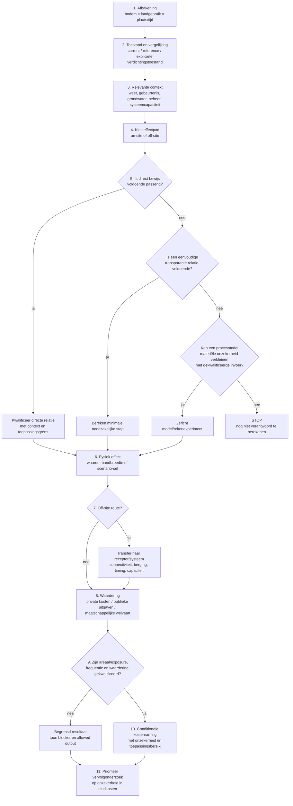

# Bespreekschema werkwijze en einddoel v0.1

**Status:** REVIEW ARTIFACT  
**Datum:** 23 september 2026  
**Doel:** compact schema voor de inhoudelijke bespreking. Dit document introduceert geen nieuwe wetenschappelijke authority. De onderliggende betekenis blijft in theorie, pathwaymatrix, evidence/qualification en het canonieke datamodel.

## 1. Wat proberen we uiteindelijk te leveren?

Niet één universeel schadegetal voor iedere combinatie van bodemtype en landgebruik.

Het beoogde eindproduct is een **conditionele raming van fysieke gevolgen en kosten**. Een resultaat hoort bij een expliciete combinatie van bodem, landgebruik, verdichtingstoestand, relevante omstandigheden en waarderingscontext.

Een bruikbare uitkomst kan zijn:

- een gekwalificeerd bedrag;
- een bandbreedte;
- afzonderlijke scenario-uitkomsten;
- een fysiek effect zonder geldwaarde;
- of expliciet: nog niet verantwoord te berekenen.

De systematiek moet dit jaar bruikbare resultaten kunnen opleveren en tegelijk uitbreidbaar blijven wanneer later betere data, literatuur of rekenexperimenten beschikbaar komen.

## 2. Werkwijze in één schema



De belangrijke keuze zit dus niet tussen “literatuur” en “model”. De vraag is steeds: **wat is de lichtste voldoende onderbouwde route naar het benodigde eindpunt?**

## 3. Wat moet in iedere uitkomst zichtbaar blijven?

### A. Afbakening

Minimaal:

- bodem- of bodemcontext;
- landgebruik/gewas;
- ruimtelijke schaal;
- tijds- of gebeurteniscontext.

### B. Verdichtingstoestand en referentie

We moeten weten welk verschil wordt onderzocht. Bijvoorbeeld:

- actuele versus minder verdichte referentie;
- lichte versus zware verdichting;
- ondiepe versus diepere verdichting;
- treatment uit een studie versus expliciete comparator.

Een behandeling uit een studie is niet automatisch dezelfde toestand als een Nederlandse current-state klasse.

### C. Conditionerende omstandigheden

Alleen omstandigheden die de uitkomst materieel kunnen veranderen hoeven expliciet mee te doen. Mogelijke dimensies zijn:

- droog, gemiddeld of nat jaar;
- omvang, intensiteit en duur van een bui;
- antecedente vochttoestand;
- grondwater en drainage;
- waterbeschikbaarheid;
- systeemconnectiviteit, berging en afvoercapaciteit;
- prijsjaar en economische invalshoek.

We hoeven dus niet vooraf alle denkbare scenario's te combineren.

### D. Effectpad

De twee hoofdtakken blijven gelijkwaardig:

**On-site:** gewasopbrengst, kwaliteit, droogtestress/beregening, werkbaarheid en private bedrijfseffecten.

**Off-site:** runoff/drainage, transfer naar watersysteem, bemaling/capaciteit, wateroverlast, regionale watervraag en later waterkwaliteit.

### E. Route naar het effect

Er zijn drie toegestane routes:

1. **direct bewijs**, als een studie of meting de bedoelde relatie voldoende goed afdekt;
2. **eenvoudige berekening**, als een transparante relatie voldoende is;
3. **procesmodel/rekenexperiment**, alleen als de ontbrekende mechanistische stap de einduitkomst materieel bepaalt en het model die onzekerheid kan verkleinen.

Als geen van deze routes voldoende is, blijft de uitkomst data- of evidence-gated.

### F. Waardering

Een fysiek effect wordt pas geld wanneer de waarderingsstap apart is gekwalificeerd.

Blijf onderscheiden:

- private kosten voor bedrijf/boer;
- publieke uitgaven;
- maatschappelijke welvaartseffecten.

Die categorieën mogen niet automatisch bij elkaar worden opgeteld.

## 4. Waar staan de effectpaden nu?

| Pad | Wat willen we kennen? | Huidige route | Belangrijkste open schakel | Wat nu niet doen |
|---|---|---|---|---|
| O1 | gewasopbrengst / productie | directe evidence-ensembles na contextmatch | actuele exposure, state/reference-koppeling, economische waarde | één landelijke opbrengstcoëfficiënt |
| O2 | gewaskwaliteit | gerichte literatuur per relevant gewas | dunne evidencebasis | kwaliteitsverlies afleiden uit opbrengstverlies |
| O3 | droogtegevoeligheid / beregeningsbehoefte | conditionele empirische grenzen | van potentiële behoefte naar werkelijk toegepaste/geleverde beregening | potentiële mm gelijkstellen aan werkelijk watergebruik |
| O4 | extra bewerkingen / werkbaarheid | bedrijfs-/praktijkevidence kan rechtstreeks bruikbaar zijn | eerst materialiteit en evidence bepalen | technische aannames als kostenfactor gebruiken |
| O5 | private bedrijfskosten | eenvoudige economische relaties | actuele crop-specifieke waardering en dubbeltellingcontrole | verschillende economische perspectieven optellen |
| F1 | extra runoff / veranderde drainage | lokale evidence of gericht procesmodel | profiel-, gebeurtenis- en state-context | één nationale mm-factor |
| F2 | levering aan sloot/netwerk | transferfactor of eenvoudige systeemtypologie indien verdedigbaar | connectiviteit, berging, routing, timing | generated runoff gelijkstellen aan delivered runoff |
| F3 | bemaling / energie / capaciteitsdruk | observed operations of dispatchberekening | representatieve systeemklassen, beschikbaarheid, head/efficiency | geïnstalleerde capaciteit gelijkstellen aan extra operatie |
| F4 | wateroverlast / piekrisico | voorlopig benchmark/context | Nederlandse systeemrespons en blootgestelde assets | buitenlandse benchmark direct monetariseren |
| F5 | regionale watervoorzieningsdruk | conditionele demand/supply-scenario's | adoption, bronbeschikbaarheid, allocatie en echte levering | potentiële vraag gelijkstellen aan geleverde hoeveelheid |
| F6 | nutriënten/pesticiden / waterkwaliteit | later gekoppeld effectpad | mobilisatie, route, retentie, receptor | nu al monetariseren zonder load/receptor-effect |

Dit overzicht is geen prioriteitenranking. Het laat zien welke route per effect waarschijnlijk passend is en waar de huidige calculation boundary ligt.

## 5. Welke onzekerheid onderzoeken we eerst?

Voor vervolgonderzoek gebruiken we geen automatische score. We stellen per open onzekerheid vier vragen.

1. **Invloed op het eindbedrag:** kan deze onzekerheid de schade- of kostenbandbreedte materieel veranderen?
2. **Verkleinbaarheid:** kunnen we haar met realistische data, literatuur of een gericht experiment daadwerkelijk kleiner maken?
3. **Doorwerking:** helpt de nieuwe kennis meerdere bodem×landgebruikcombinaties of effectpaden?
4. **Poortfunctie:** blokkeert deze onzekerheid een hele downstream berekening?

Een fysisch interessante onzekerheid met weinig invloed op de eindkosten kan dus lager uitkomen dan een eenvoudiger ontbrekend gegeven zoals getroffen areaal, eventfrequentie of economische waarde.

## 6. Hoe dit naar een applicatie of workbook vertaalt

De gebruikersinterface hoeft de volledige technische architectuur niet te tonen. De minimale review-/applicatieview is:

```text
SELECTIE
bodem × landgebruik × scenario/context

↓
EFFECTPAD
wat kan bodemverdichting hier veroorzaken?

↓
BEWIJS / BEREKENING
welke bron, relatie of modelstap ondersteunt dit?

↓
READINESS
wat is gekwalificeerd, wat ontbreekt, wat mag worden berekend?

↓
UITKOMST
fysiek effect / bandbreedte / kosten / nog niet berekenbaar

↓
HERKOMST EN BEPERKING
bron → qualification → aannames → toepassingsbereik → dominante onzekerheid
```

De interface is daarmee een view op canonieke projectstate. Zij definieert niet zelf de betekenis.

## 7. Wat willen we dinsdag expliciet bespreken?

De bespreking hoeft niet te beslissen over ieder detail. De belangrijkste vragen zijn:

1. Is een **conditionele kostenraming** het juiste beeld van het eindproduct?
2. Zijn de belangrijkste scenario-/contextdimensies herkenbaar, zonder dat we te veel vooraf willen vastleggen?
3. Is de keuze tussen direct bewijs, eenvoudige berekening en procesmodel logisch?
4. Zijn on-site en off-site voldoende gelijkwaardig gepositioneerd?
5. Zijn de huidige calculation boundaries geloofwaardig?
6. Welke twee of drie onzekerheden bepalen waarschijnlijk het sterkst de uiteindelijke kostenbandbreedte?
7. Waar willen we volgend jaar gericht kennis toevoegen?

Een goede uitkomst van het gesprek is dus niet één definitief rekenrecept. Het is overeenstemming over **hoe we van beperkte, heterogene kennis toch tot traceerbare en uitbreidbare kostenramingen komen**.
